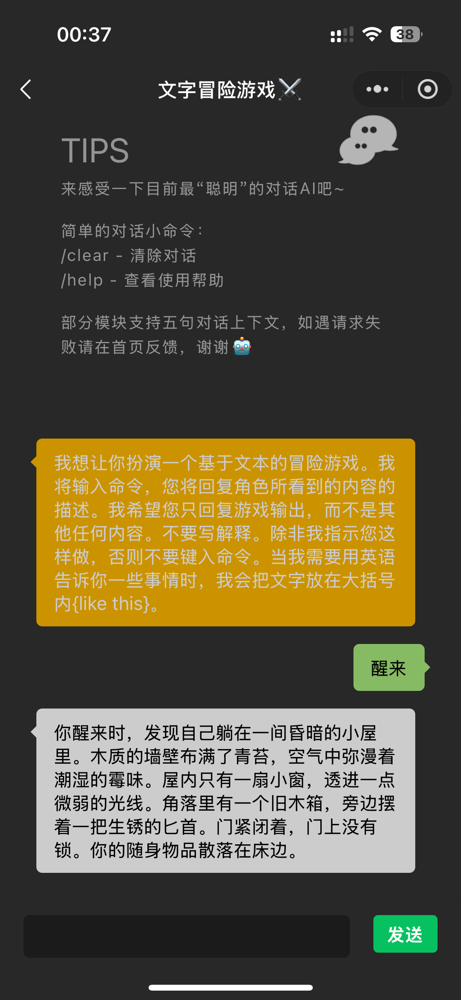
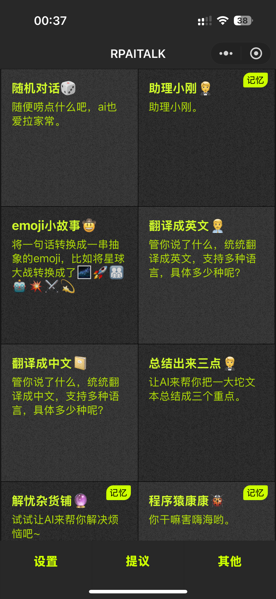
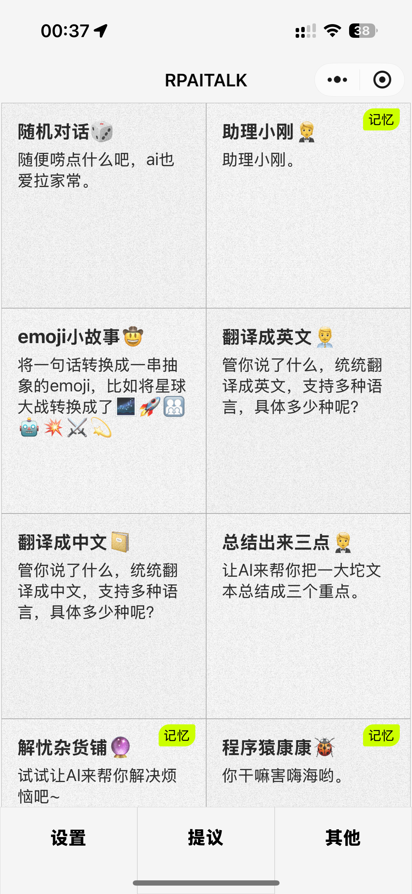
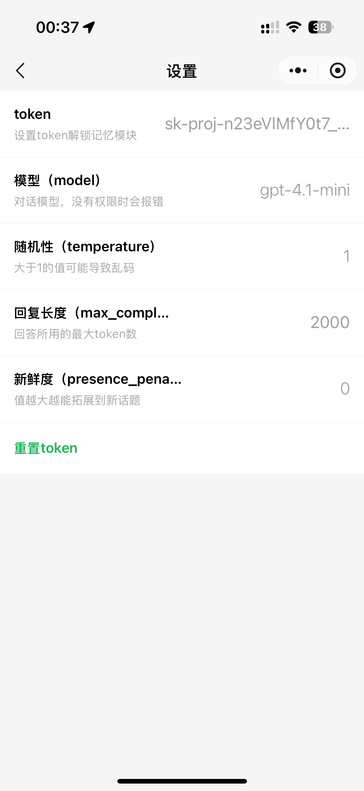

# RPAITALK

基于微信小程序平台开发的 OpenAI 对话应用，提供流畅的 AI 对话体验。

## 📱 应用截图

<div align="center">
  
  
  
  
</div>

## 📝 项目介绍

RPAITALK 是一个封装了 OpenAI API 的微信小程序，支持多种对话模式，为用户提供智能、流畅的对话体验。无论是日常聊天、学习辅助还是创意激发，都能通过不同的对话角色满足您的需求。

## ✨ 功能特点

- 🤖 支持多种对话模式和角色设定
- 💬 上下文连续对话，实现更自然的交流
- 📋 聊天记录本地持久化存储
- 🔄 自定义系统 Prompt
- 🔑 支持自定义 API Key 配置
- 🌙 支持明暗主题切换
- 🔔 友好的错误提示与异常处理

## 🚀 快速开始

### 环境要求

- 微信开发者工具
- OpenAI API Token

### 使用步骤

1. 克隆仓库

   ```bash
   git clone https://github.com/rabithua/RPAITALK.git
   ```

2. 使用微信开发者工具打开项目

3. 在设置页面配置您的 OpenAI API Token

4. 编译运行体验

## 📁 项目结构

```
miniprogram/
  ├── pages/         # 小程序页面
  │   ├── home/      # 首页
  │   ├── index/     # 聊天页面
  │   ├── others/    # 其他页面
  │   └── settings/  # 设置页面
  ├── state/         # 全局状态管理
  ├── utils/         # 工具类和API请求
  └── assets/        # 静态资源
```

## 🛠️ 开发相关

### 技术栈

- 微信小程序原生开发
- TypeScript
- OpenAI API

### 自定义对话模式

在 `state/main.ts` 中可以配置不同的对话模式和角色设定。

## 📄 许可证

MIT License
